# Experiment Results
To train self-supervised model we used same hyperparameters as was used in paper: 
| Hyperparameter  | Value |
| ------------- | ------------- |
| Number of epochs | 265 |
| Batch size | 32 |
| Learning rate | 0.03 |
| Input size | 256 |

## AUC comparison of our code and paper results
TODO: add results of our 3 way experiment

| Defect Name  | CutPaste binary (ours) | CutPaste binary (paper's)  | CutPaste 3 way (ours) | CutPaste 3 way (paper's)  | 
| ------------- | ------------- | ------------- | ------------- | ------------- | 
| tile  | 84.1 | 95.9 |  | 93.4 |
| wood  | 89.5 | 94.9 |  | 98.6 |
| pill | 88.7 | 93.4 |  | 92.4 |
| leather | 98.7 | 99.7 |  | 100.0 |
| hazelnut | 98.8 | 91.3 |  | 97.3 |
| screw | 89.2 | 54.4 |  | 86.3 |
| cable | 83.3 | 87.7 |  | 93.1 |
| toothbrush | 94.7 | 99.2 |  | 98.3 |
| capsule | 80.2 | 87.9 |  | 96.2 |
| carpet | 57.9 | 67.9 |  | 93.1 |
| zipper | 99.5 | 99.4 |  | 99.4 |
| metal_nut | 91.5 | 96.8 |  | 99.3 |
| bottle | 98.5 | 99.2 |   | 98.3 |
| grid | 99.9 | 99.9 |   | 99.9 |
| transistor | 84.4 | 96.4 |  | 95.5 |

### ROC curves using embeddings from binary classification for self-supervised learning

  
Click to see ROC curves!

  
  

    
    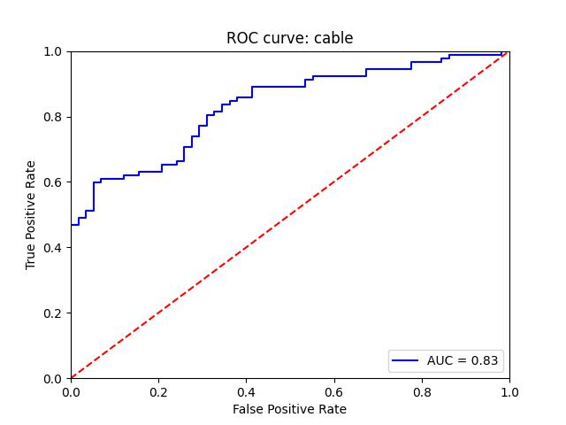 
    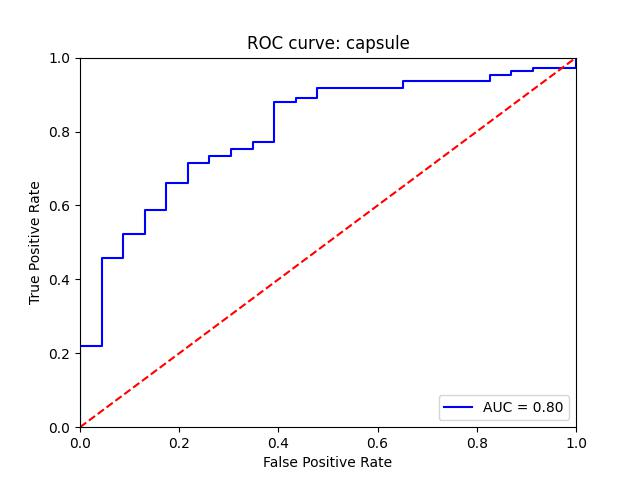
  

  

    
    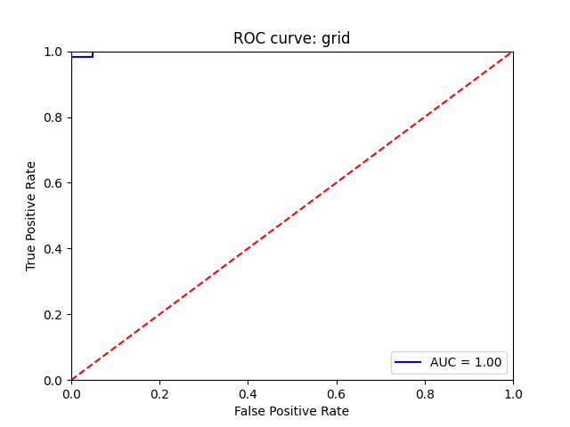 
    
  

  

    
    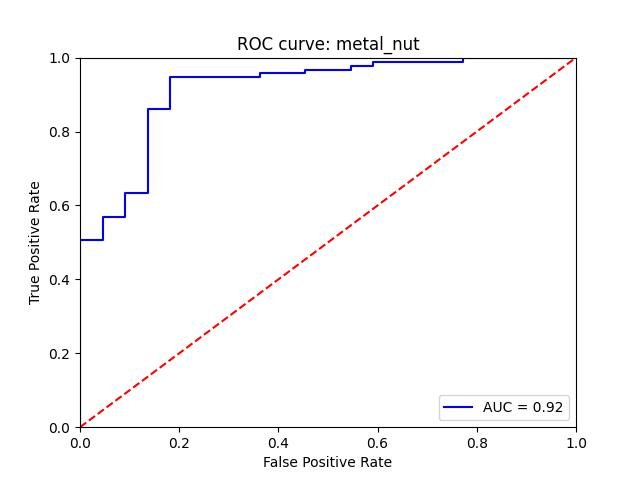 
    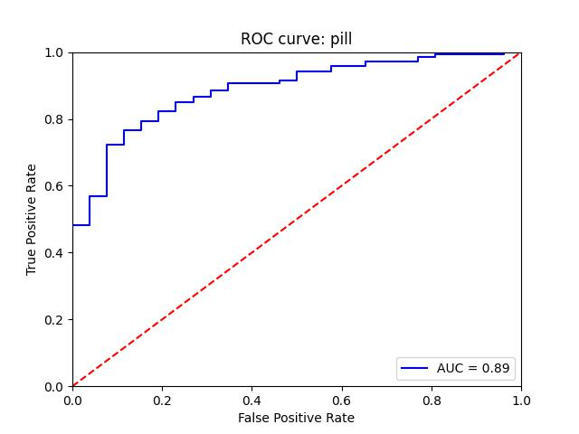
  
 

  

    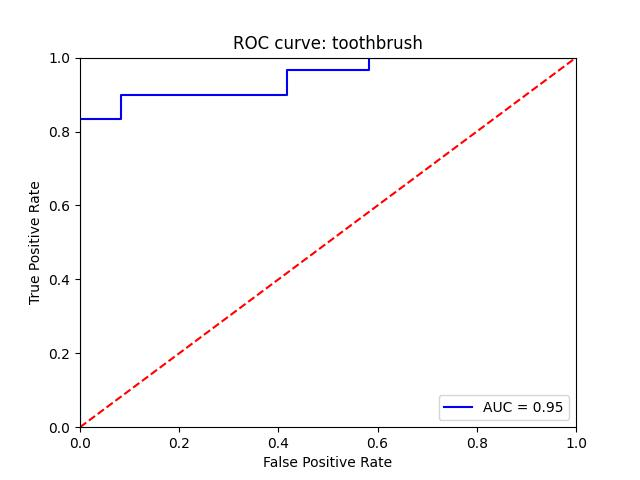
    
    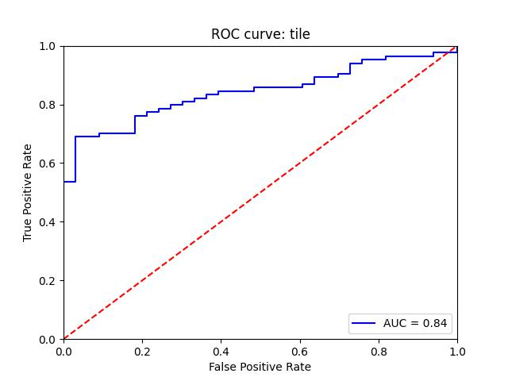 
  
 

  

    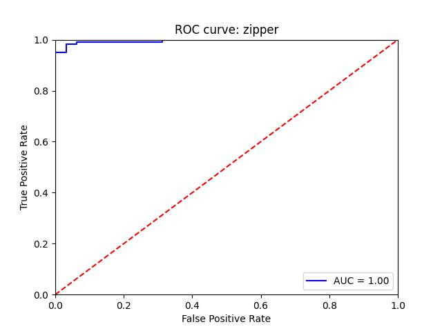
    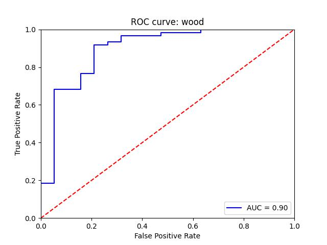 
    
  

### Self-supervised binary training results

  
Click to see self-supervised training results!

  
  **Training accuracy and loss for bottle**
  

    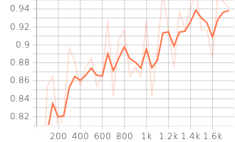
    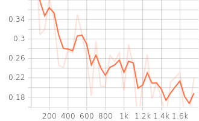 
  

  **Training accuracy and loss for pill**
  

    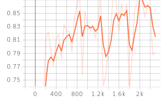
    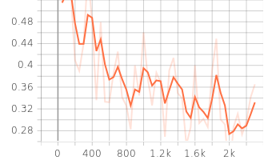 
  

  **Training accuracy and loss for cable**
  

    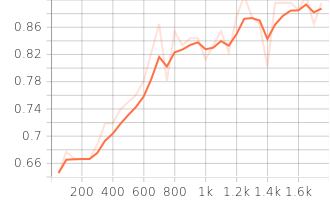
     
  

  **Training accuracy and loss for capsule**
  

    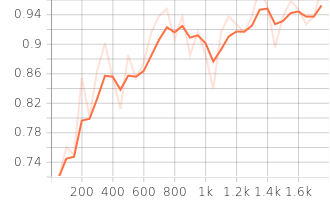
    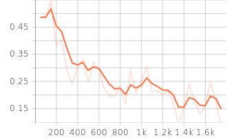 
  

  **Training accuracy and loss for tile**
  

    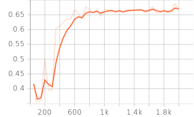
    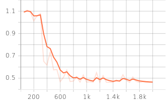 
  

### Self-supervised 3-way training results

  
Click to see self-supervised training results!

  
  **Training accuracy and loss for pill**
  

    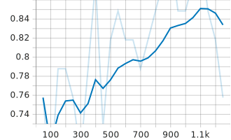
    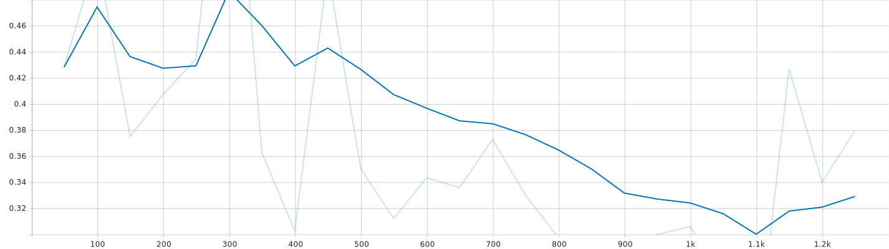 
  

  **Training accuracy and loss for screw**
  

    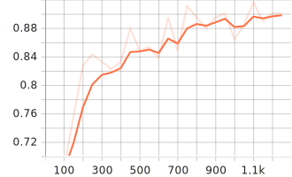
    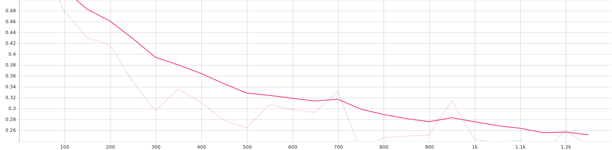 
  

  **Training accuracy and loss for tile**
  

    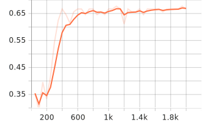
    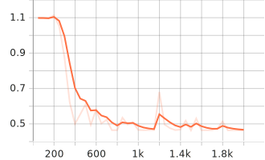 
  

  **Training accuracy and loss for zipper**
  

    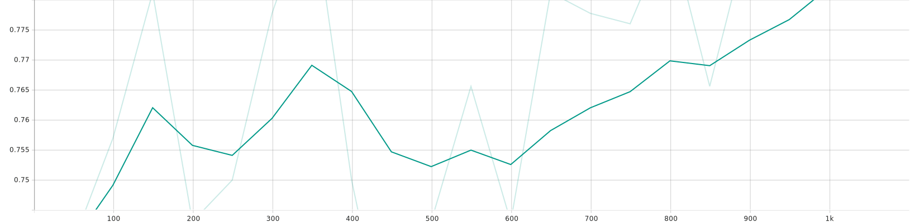
    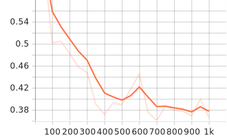 
  

### t-SNE visualisation of embeddings 

  
Click to see t-SNE visualisations!

  

  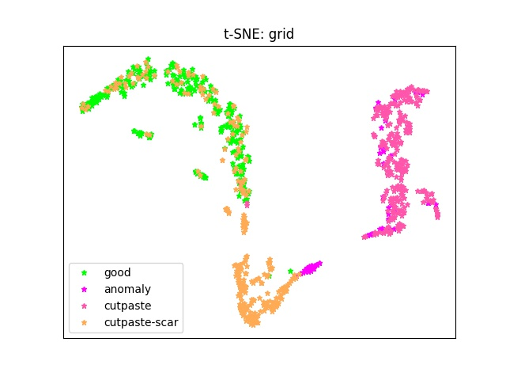
  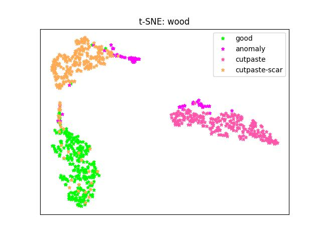 

  
